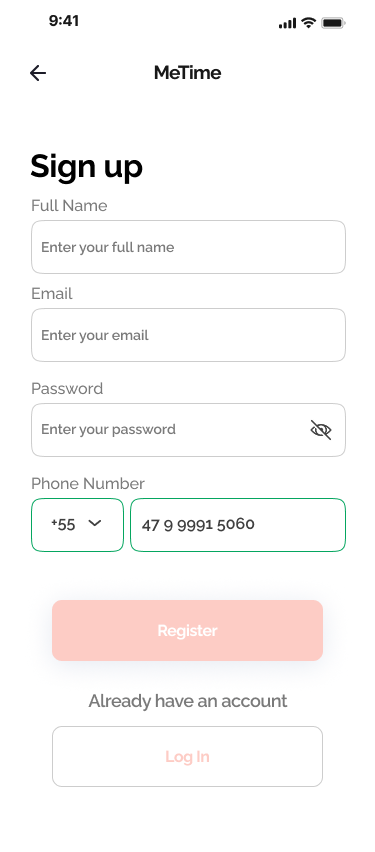
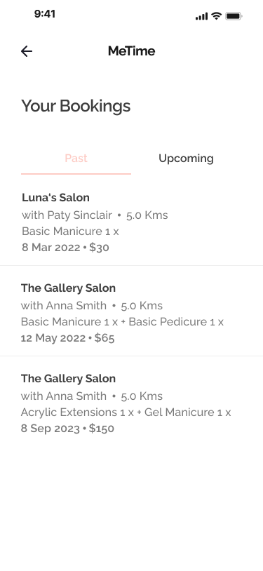
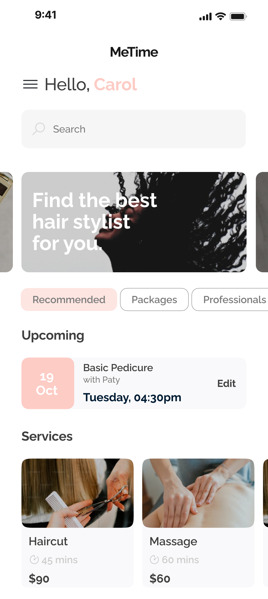

# MeTime - Salon Booking App

A Flutter-based salon appointment booking application designed from Figma prototypes. Users can browse services, choose professionals, book appointments, and manage their bookings.

## Screenshots

<table>
  <tr>
    <td></td>
    <td></td>
    <td></td>
    <td></td>
  </tr>
  <tr>
    <td align="center">Home</td>
    <td align="center">Choose Service</td>
    <td align="center">Choose Type</td>
    <td align="center">Choose Professional</td>
  </tr>
  <tr>
    <td></td>
    <td></td>
    <td></td>
    <td></td>
  </tr>
  <tr>
    <td align="center">Login Phone</td>
    <td align="center">Enter Code</td>
    <td align="center">Sign Up</td>
    <td align="center">Calendar</td>
  </tr>
  <tr>
    <td></td>
    <td></td>
    <td></td>
    <td></td>
  </tr>
  <tr>
    <td align="center">No Preference</td>
    <td align="center">Booking Success</td>
    <td align="center">Past Bookings</td>
    <td align="center">Upcoming Bookings</td>
  </tr>
  <tr>
    <td></td>
    <td></td>
    <td></td>
    <td></td>
  </tr>
  <tr>
    <td align="center">Main Page</td>
    <td align="center">Salon Details</td>
    <td align="center">Cancel Booking</td>
    <td></td>
  </tr>
</table>

## Features

- Onboarding flow with service and professional selection
- Phone number login with country code picker and format masking
- Code verification system
- User registration with Firestore
- Appointment booking with date and time selection
- Dynamic calendar with month/year navigation
- Booking management (upcoming & past bookings)
- Cancel appointment with confirmation dialog
- Salon details page with reviews and ratings
- Search functionality for services
- Persistent user session (SharedPreferences)
- Responsive design for all device sizes

## Tech Stack

- **Framework:** Flutter
- **Backend:** Firebase (Firestore)
- **State:** StatefulWidget + Static variables
- **Storage:** SharedPreferences (local session)
- **Fonts:** Raleway, Montserrat (local assets)
- **Icons:** Custom SVG/PNG assets

## Project Structure

```
lib/
├── main.dart                          # App entry point, Firebase init, session check
├── core(gerekli)/
│   ├── color.dart                     # App color palette
│   └── responsive.dart                # Responsive system (compact/mobile/tablet/desktop)
├── pages/
│   ├── home_page.dart                 # Onboarding welcome page
│   ├── main_page.dart                 # Main dashboard (after login)
│   ├── onboarding_choose_service.dart # Service selection (Nail, Hair, etc.)
│   ├── onboarding_choose_type_nail.dart # Service type selection
│   ├── onboarding_choose_proffesionel.dart # Professional selection
│   ├── professionals_calendar.dart    # Date & time booking
│   ├── proffessionals_no_preference.dart # No preference booking
│   ├── login_phone.dart               # Phone number input
│   ├── login_phone_code.dart          # Code verification
│   ├── sign_up.dart                   # Registration form
│   ├── successful_page.dart           # Booking confirmation
│   ├── bookings_page.dart             # Past & upcoming bookings
│   └── salon_page.dart                # Salon details & reviews
├── widgets/
│   ├── app_button.dart                # Primary & text buttons
│   ├── app_card.dart                  # Service & professional cards
│   ├── app_header.dart                # MeTime header
│   ├── state_dots.dart                # Step indicator dots
│   ├── text_field.dart                # Text fields (name, email, password, phone)
│   └── page_sheet.dart                # Bottom sheets & dialogs (login, cancel, calendar)
├── services/
│   ├── booking_service.dart           # Firestore booking CRUD
│   └── user_service.dart              # User auth, session management
└── firebase_options.dart              # Firebase config (gitignored)
```

## App Flow

```
HomePage (onboarding)
├── Start → Choose Service → Choose Type → Choose Professional
│   ├── Select Professional → Login → Calendar → Book → Success
│   └── No Preference → Login → No Preference Calendar → Book → Success
├── Skip → Login → MainPage
└── Sign Up → Code Verify → MainPage

MainPage (after login)
├── Services → Choose Type → Choose Professional → Calendar → Book
├── Ads Banner → Salon Details
├── Upcoming Card → Bookings Page
└── Search → Filter Services
```

## Responsive Design

| Device | Screen Type | Grid Columns |
|--------|-------------|-------------|
| Galaxy Z Fold (280px) | Compact | 1 |
| iPhone SE (375px) | Mobile | 2 |
| Samsung S20 (412px) | Mobile | 2 |
| iPhone 14 Pro Max (430px) | Mobile | 2 |
| iPad Mini (768px) | Tablet | 3 |
| iPad Pro (1024px) | Desktop | 4 |
| Landscape mode | Auto-adjusted | +1 column |

## Setup

1. Clone the repository
```bash
git clone https://github.com/emrebykdr/figmaMeTime.git
cd figmaMeTime
```

2. Install dependencies
```bash
flutter pub get
```

3. Configure Firebase
```bash
flutterfire configure
```

4. Run the app
```bash
flutter run
```

## Firebase Setup

- Enable **Firestore Database** in Firebase Console
- Create in **test mode** for development
- Collections used: `users`, `bookings`

## License

This project is for educational purposes.
